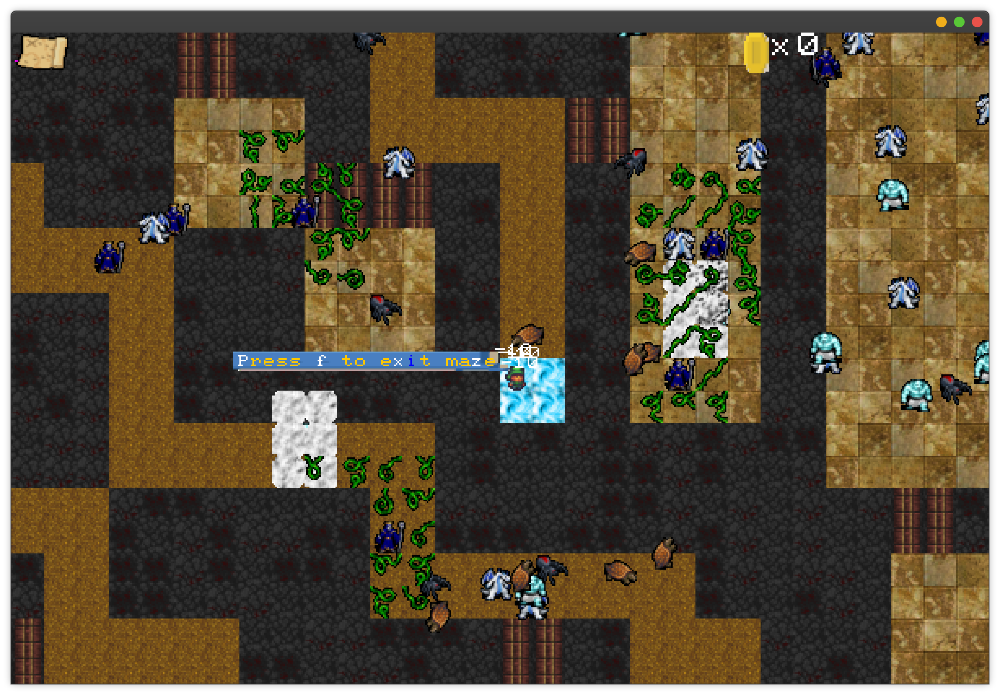

# 05： Rouge Like

## 游戏预览

## 代码结构

## 思路介绍

## 借助的外部模块和代码

- 图片旋转实现参考：https://zhuanlan.zhihu.com/p/69346379
- 肉鸽地牢生成算法思路参考：https://indienova.com/indie-game-development/rooms-and-mazes-a-procedural-dungeon-generator/
- 本项目绝大部分图片资源来自https://opengameart.org/